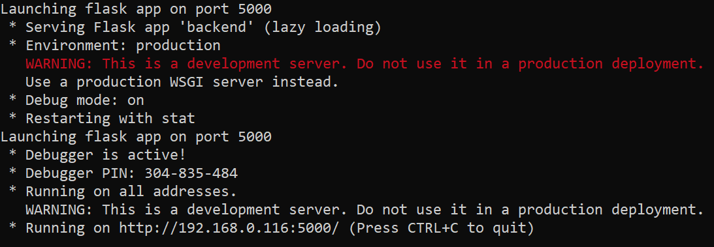

# How to use Route Finder

Requirements: Web Browser, Python

To use Route Finder on the production server, visit our [website](https://tsp.idsos.org).

To run Route Finder on a local machine, make sure [Python](https://www.python.org/) is installed. Once installed, run the following command in the command line in order to install the required dependencies (Flask, etc.):

`pip install -r requirements.txt`

To startup the server, run the following command:

`python backend.py config.js`

If the output resembles the above, the local server deployed successfully. The port on which the server is launched will be displayed in the output given by Flask (`Launching flask app on port XXXX`)

To access the app on a local machine, visit "http://localhost:XXXX", substituting the port number found in the previous step.

To terminate the local server, press ^C (Control-C) in the command window.
